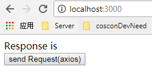
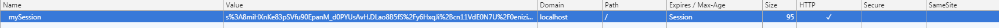
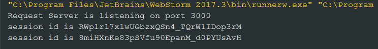
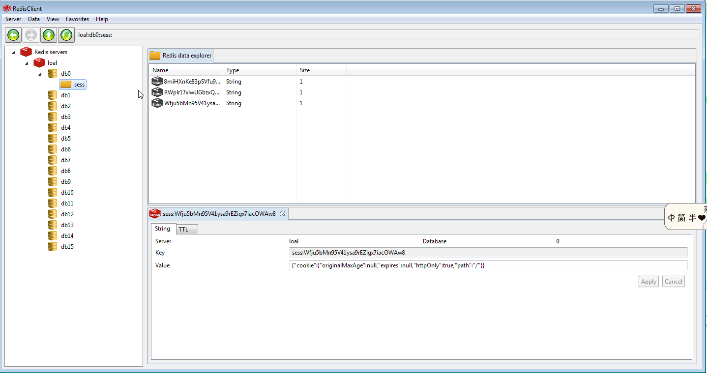

# Guide to store session in Redis

##1. Prepare

[官网](http://redis.io)

[windows 下安装指南](http://redis.io/download)

[Redis client](http://www.redis.net.cn/)

Redis client 下载解压缩就行

##2. 启动Redis

##3. 启动应用

安装依赖包
```bash 
$ node server
```

##4. 访问localhost:3000



点击send,浏览器的cookie里可以看到



控制台输出



redis client 查看




